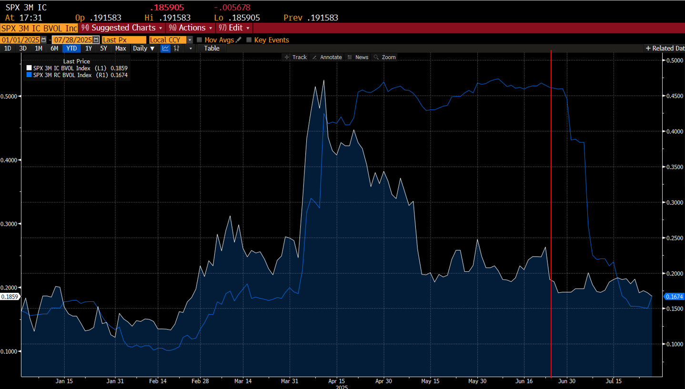
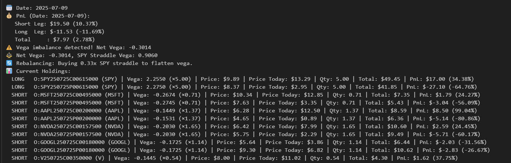
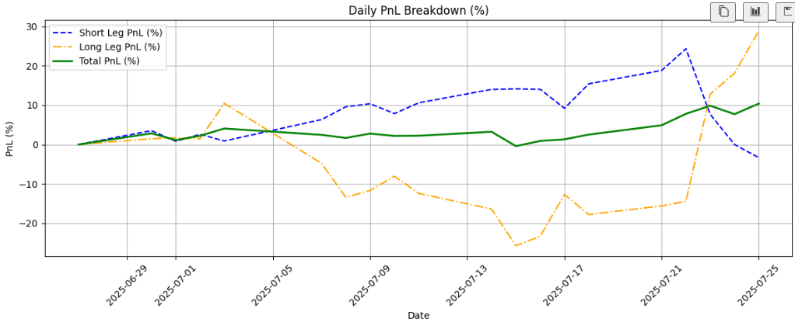

# Dispersion Strategy Backtest

This project implements a **delta- and vega-neutral reverse dispersion trading strategy** using historical options and correlation data. Website Link: https://dispersion-algorithm.streamlit.app/

---

## 📉 Why Reverse Dispersion?

After observing a significant divergence between **implied** and **realized correlation** starting mid-April 2025, we pivoted from traditional dispersion to **reverse dispersion**.

The chart below shows SPX 3M Implied Correlation (white) vs. SPX 3M Realized Correlation (blue):

> **Observation**: Around June 23, 2025, realized correlation dropped, but remained **above** implied correlation. Combined with low volatility in individual stocks and sustained index movement, this created a favorable setup for reverse dispersion — where short single-name straddles benefited from decay, and the long index straddle captured broader market moves.

---

## 🧠 Strategy Summary

In **reverse dispersion**, we **short single-name option straddles** and **long the index straddle**, aiming to profit when **realized correlation stays higher than implied correlation**.

The strategy works best when stocks move **together** (high realized correlation), but not by much individually. In this case, the single-name options lose value from **theta decay** and **implied volatility bleed**, while the index straddle benefits from capturing the broader market’s movement.

Even if realized correlation starts to fall, reverse dispersion can still perform well **as long as it's higher than implied correlation**, which creates the pricing mismatch the trade is based on.

Key properties of our reverse dispersion trading algorithm:
- **Vega-neutral**: Net vega exposure is dynamically neutralized using SPY straddles to focus on the alpha generated from correlation mispricing, not volatility exposure.
- **Rolling Adjustments**: Positions are rebalanced daily based on new greeks and prices.
- **Expiry-Aware**: Hedging stops within 3 days of expiry to prevent tail-end risk.

---

## ⚙️ Features

- ✅ Dynamic Vega Hedging
- ✅ Expiry-aware Hedge Suppression
- ✅ Daily Net Vega Monitoring
- ✅ PnL Logging by Leg (Index vs. Stocks)
- ✅ Data From Polygon API and Bloomberg Terminal

---

## 📁 Files

- `dispersion.ipynb` – Strategy logic + backtest loop
- `Bloomberg_Vega.xlsx` – Historical vega inputs
- `optimized_weights.xlsx` – Portfolio weights
- `.env` – (not committed) stores API keys

---

## 📊 Example Output

---

## 🛠️ Setup

Installation and dependencies:
<pre><code>git clone https://github.com/jeffery05/dispersion-strategy.git
pip install -r requirements.txt</code> </pre>

Create a .env file with your Polygon.io API keys:

<pre><code>STOCK_API_KEY=your_polygon_stocks_api_key_here
OPTIONS_API_KEY=your_polygon_options_api_key_here</code></pre>

Run the notebook: dispersion.ipynb

---

## 📈 Results
This reverse dispersion strategy achieved a total return of **+10.4%** over the one-month backtest period (June 23, 2025 – July 25, 2025).
It used a dynamic vega-neutral hedging mechanism with a maximum vega imbalance threshold of ±10% before re-hedging.

Daily percentage PnL for the long leg, short leg, and total portfolio is visualized below:

## 🧠 Credits
Built by the UW FARMSA Quantitative Research Team (Summer 2025) for academic and research purposes. Inspired by real-world institutional volatility strategies.
