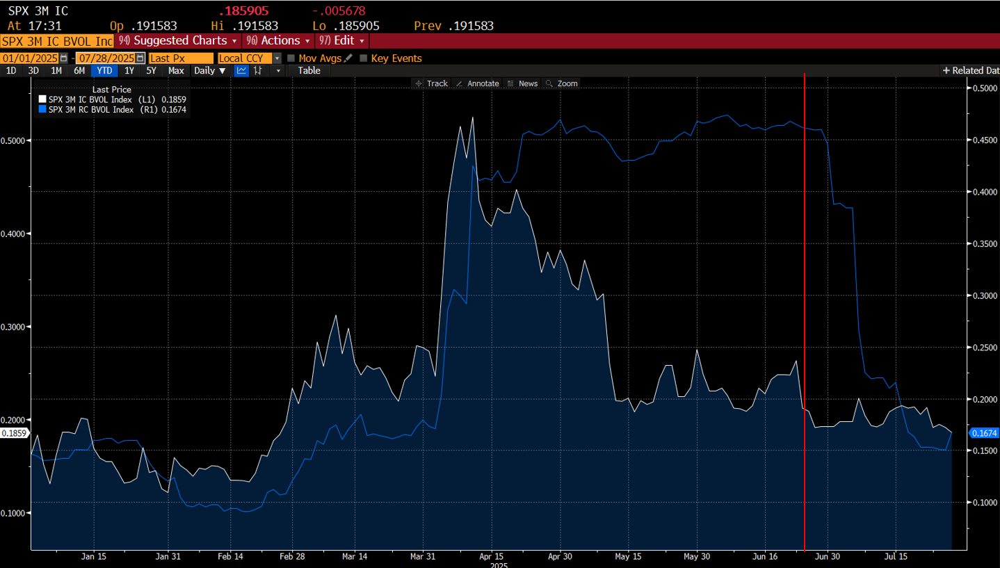
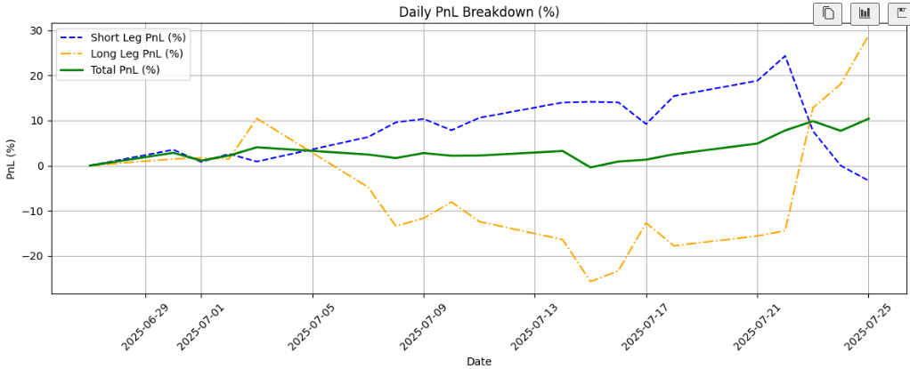

# Dispersion Strategy Backtest

This repository implements a **vega-neutral reverse dispersion trading strategy** using historical options and correlation data.

---

## 📉 Why Reverse Dispersion?

After observing a significant divergence between **implied** and **realized correlation** starting mid-2025, we pivoted from traditional dispersion to **reverse dispersion**.

The chart below shows SPX 3M Implied Correlation (white) vs. SPX 3M Realized Correlation (blue):

> **Observation**: Implied correlation remained elevated while realized correlation collapsed around **June 23, 2025**, creating an attractive setup for reverse dispersion.

---

## 🧠 Strategy Summary

In reverse dispersion, we **short single-name options** (straddles) and **long the index straddle**, aiming to profit when constituent stocks move **more in sync** than expected.

Key properties:
- **Vega-neutral**: Net vega exposure is dynamically neutralized using SPY straddles.
- **Rolling Adjustments**: Positions are rebalanced daily based on new greeks and prices.
- **Expiry-Aware**: Hedging stops within 3 days of expiry to prevent tail-end risk.

---

## ⚙️ Features

- ✅ Dynamic Vega Hedging
- ✅ Expiry-aware Hedge Suppression
- ✅ Daily Net Vega Monitoring
- ✅ PnL Logging by Leg (Index vs. Stocks)
- ✅ Percentage and Dollar-based PnL Plots
- ✅ Data From Polygon API and Bloomberg Terminal

---

## 📁 Files

- `dispersion.ipynb` – Strategy logic + backtest loop
- `Bloomberg_Vega.xlsx` – Historical vega inputs
- `optimized_weights.xlsx` – Portfolio weights
- `.env` – (not committed) stores API keys

---

## 📊 Example Output

🗓️ Date: 2025-07-25
💰 PnL (Total): -$9.53 (-3.41%)
⚖️ Net Vega: -0.1620, SPY Straddle Vega: 0.8020
🔄 Rebalancing: Buying 0.20x SPY straddle to flatten vega.
  LONG  SPY Straddle         | PnL: $3.12
  SHORT AAPL Straddle        | PnL: $-2.54

---

## 🛠️ Setup

Installation and dependencies:
<pre> <code>git clone https://github.com/jeffery05/dispersion-strategy.git
pip install -r requirements.txt</code> </pre>

Create a .env file with your Polygon.io API keys:

<pre> <code>STOCK_API_KEY=your_stock_key_here
OPTIONS_API_KEY=your_options_key_here</code> </pre>

Run the notebook: dispersion.ipynb

---

## 📈 Results
This reverse dispersion strategy achieved a total return of **+10.4%** over the one-month backtest period (June 27, 2025 – July 25, 2025).
It used a dynamic vega-neutral hedging mechanism with a maximum vega imbalance threshold of ±10% before re-hedging.

Daily percentage PnL for the long leg, short leg, and total portfolio is visualized below:

## 🧠 Credits
Built by Jeffery Hu & the UW FARMSA Quantitative Research Team for academic and research purposes. Inspired by real-world institutional volatility strategies.
